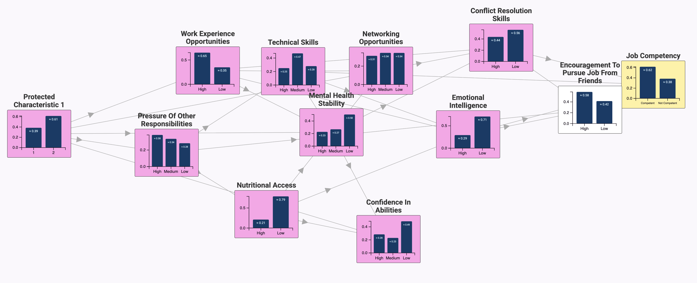
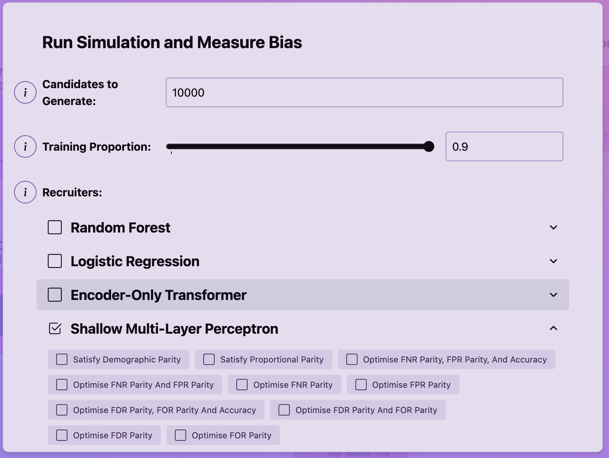
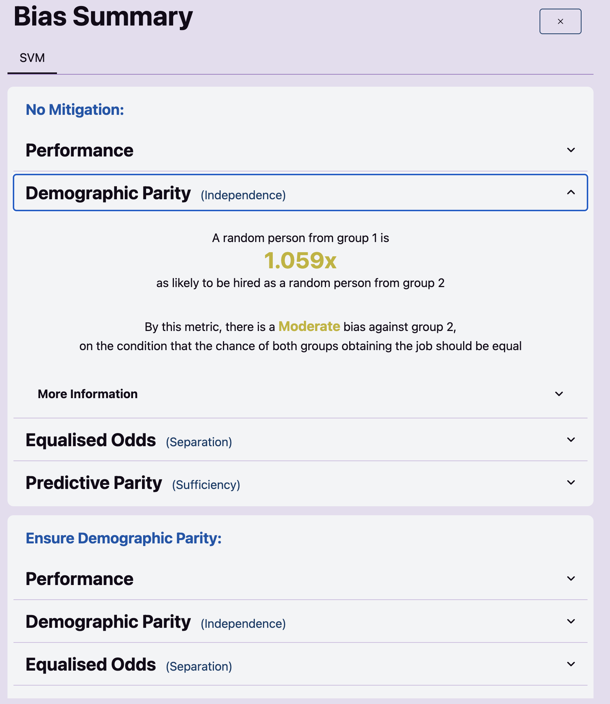
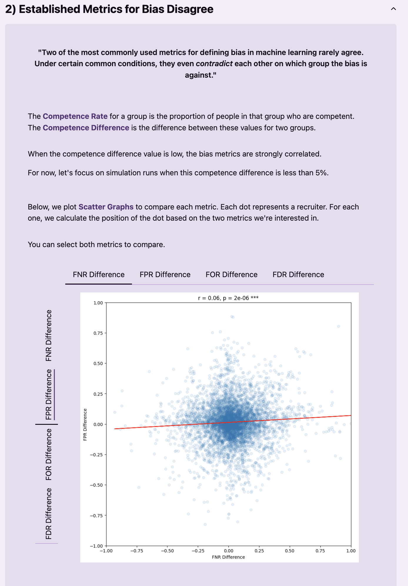

# Bayesian Network Bias Simulation



A research tool for studying algorithmic bias in hiring. An accompanying website explains the research for a technical and non-technical audience.
It lets you define a Bayesian network representing the statistical relationships between candidate characteristics, generate synthetic applicants 
from it, run those applicants through various ML recruitment models, apply bias mitigation strategies, and measure the resulting fairness outcomes 
across different criteria.

The core idea is that the Bayesian network acts as a controllable ground truth — you decide how characteristics like demographic group, qualifications, 
and scores are correlated, then observe how different recruiters and mitigations respond to that structure.

The tool has two modes: a free-form **visualisation** where you build and explore a network interactively, and a **walkthrough** that guides you through 
a single simulation run.

This website accompanies a dissertation written by me (David McIntosh) for my third year of undergraduate study at University of Cambridge.
The dissertation can be viewed [here](https://flamingowinter.github.io/dissertation/dissertation.pdf), and the site can be viewed at www.modelling-bias.com.

If you're only interested in the results of the research, a summary is at www.modelling-bias.com/walkthrough/the_results.

## Modules

**`backend/`** — Python/Django. Bayesian network construction and sampling, synthetic applicant generation, recruiter models (logistic regression, random forest, SVM, MLP, transformer, Bayesian), bias mitigation strategies, fairness measurement, and a REST + WebSocket API.

**`frontend/`** — SvelteKit. Interactive D3 graph visualisation of the Bayesian network, distribution charts for each characteristic, bias results display, walkthrough, and guide.







## Setup

Development on macOS is preferred. For other platforms see [`docs/setup_linux.md`](docs/setup_linux.md) or [`docs/setup_windows.md`](docs/setup_windows.md).

### Prerequisites

Install Miniconda (backend package manager):
```bash
brew install --cask miniconda
conda init zsh
```

Install Taskfile (task runner):
```bash
brew install go-task
```

Install Node and pnpm (frontend package manager):
```bash
brew install node
brew install pnpm
```

### Install dependencies

```bash
task install
```

This creates the conda environment from `environment.yml` and installs frontend packages.

### Run

```bash
task backend   # Django dev server
task frontend  # Vite dev server
```

> The frontend requires the backend server to be running.

### Adding or changing dependencies

Edit `environment.yml`, then:

```bash
task install-backend
```
